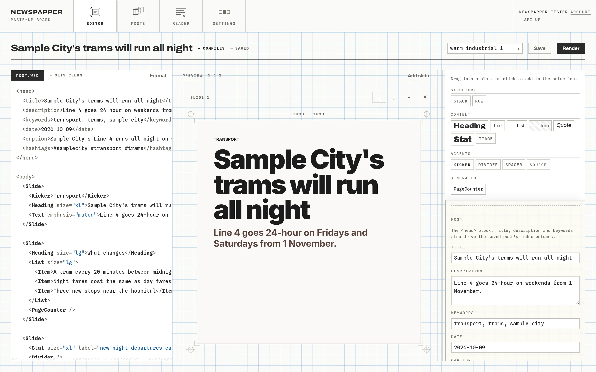
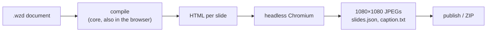

# Newspapper

A web app for writing Instagram-style news posts by hand. You write the post in a small markup language, see each slide laid out on a live 1080×1080 canvas as you type, and export the slides as JPEGs with a caption.

<p align="center">
  
</p>

**Status:** Personal project with one user. It runs at <https://gandolh.ro/newspapper/>, behind a Ward sign-in that needs a `newspapper` grant. The Reader, which stores RSS items for you to read (brief 105), is built and tested locally but not deployed yet.

## What it does

- You write a post as a `.wzd` document: a `<head>` with the title, caption and hashtags, then one `<Slide>` per image.
- The canvas redraws on every keystroke. The linter flags an unknown component, a bad prop value or a missing title as you type.
- Render screenshots each slide in headless Chromium and writes 1080×1080 JPEGs, `slides.json` and `caption.txt` to `output/YYYY-MM-DD-N/`.
- Publish runs a one-time JPEG optimisation pass. Export ZIP downloads the run, ready to upload by hand.
- The Reader follows your RSS feeds, searches them by keyword and keeps the items you save, with a note, to write from.

No model writes anything, local or remote; you type every word. Props choose from the theme's named scales and there is no raw CSS field, so a post cannot drift off its theme. It does not post to Instagram or schedule anything, and it is built for a desktop browser.

## Screenshots


Select text in the source pane, type, and the canvas follows. The preview below it stacks every slide in the post.


The posts list. Each card has a thumbnail of the latest render; the left one has been published.

| The four JPEGs one render wrote |
|---|
|  |

## How it works

It is three npm workspaces, and dependencies run one way: `ui → api → core`. `core` holds the `.wzd` parser, formatter, linter and compiler, the Chromium renderer, RSS fetching and SQLite storage. The compiler also runs in the browser, so the editor's preview and the final render come from the same code. `api` is a Fastify server on port 3001; it checks a Ward session on every `/api/*` route except the health check, and streams search, render and Reader refresh over server-sent events. `ui` is a Vite + React app on port 4321.



More on the docs site: [architecture](https://gandolh.ro/newspapper/docs/wiki/architecture/) and [the `.wzd` language](https://gandolh.ro/newspapper/docs/wiki/markup/). A walkthrough of writing one post is in [docs/making-a-post.md](docs/making-a-post.md).

## Run it locally

Requires Node 24 and a local Ward for sign-in. `package.json` declares no `engines` field, but the repo is developed and checked on Node 24. Ward runs from the container in `../wzd_auth/infrastructure/local`.

```bash
npm install
npx playwright install chromium   # the renderer's browser; npm install does not fetch it
cp .env.example .env              # then run Ward's seed.mjs, which writes the Ward keys into it
npm run dev                       # API on :3001, UI on :4321
```

Open <http://localhost:4321/newspapper/> and sign in through Ward. If Ward is not running, the API still starts but every guarded route answers 503. The [configuration](https://gandolh.ro/newspapper/docs/wiki/configuration/) page lists every env var, and [commands](https://gandolh.ro/newspapper/docs/wiki/commands/) lists every npm script with what it does not check.

## Project layout

| Path | What lives there |
|---|---|
| `core/` | `@newspapper/core`: the `.wzd` language, the renderer, RSS and the Reader, SQLite storage, uploads |
| `api/` | `@newspapper/api`: the Fastify server, the Ward guard, static serving in production |
| `ui/` | `@newspapper/ui`: the Vite + React app (editor, posts, Reader, settings) |
| `assets/` | The three slide themes as JSON tokens, and the Inter fonts the renderer loads |
| `docs/` | The Starlight docs site, plus the images and guides this README links to |
| `infrastructure/` | Dockerfile and compose file for the container |
| `corpus/` | The project wiki, the briefs that built it, and the change log |

## Docs

- [docs/](docs/README.md): the post walkthrough, the images used here, and how the docs site is built
- Docs site: <https://gandolh.ro/newspapper/docs/>, rendered from `corpus/` on every build
- Project wiki: [corpus/](corpus/index.md), with [status](corpus/wiki/status.md) and [decisions](corpus/wiki/decisions.md)
- Before trusting a green command here, read [green-because-nothing-ran.md](corpus/wiki/green-because-nothing-ran.md)

## License

MIT, as declared in `package.json`. There is no LICENSE file in the repo yet.
