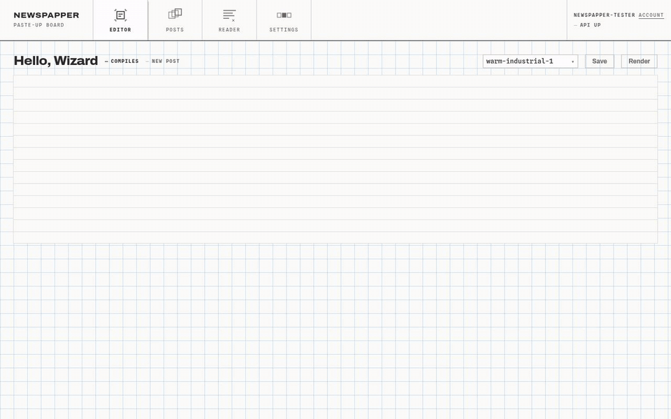
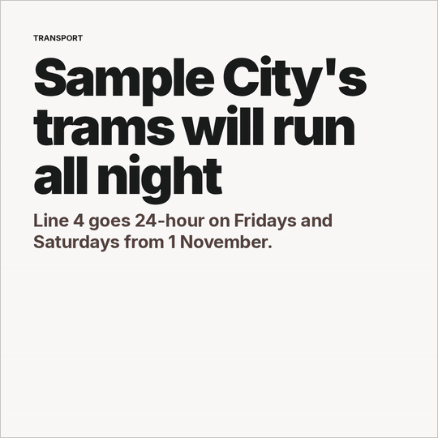
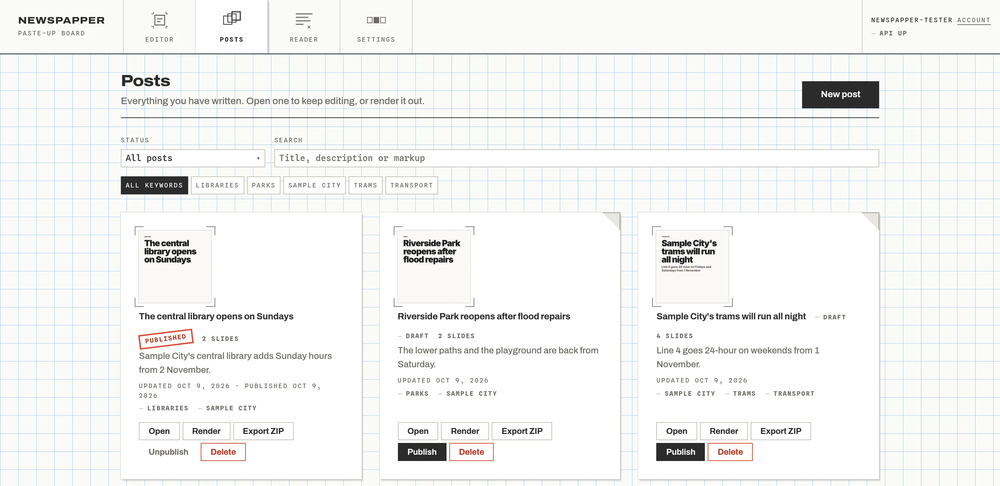

# Making a post

One post from an empty editor to a ZIP of slides. This is the walkthrough that used to sit in the main README. The full language reference is the [`.wzd` markup page](https://gandolh.ro/newspapper/docs/wiki/markup/) ([source](../corpus/wiki/markup.md)).

## 1. Write it

You land on the editor (`/`) with a starter document already loaded. The left pane is the `.wzd` source, the middle is the live 1080×1080 canvas, and the right holds the component palette and the post's fields.

A document has two top-level elements, and casing carries the meaning. Lowercase tags are metadata; capitalised tags draw.

```wzd
<head>
  <title>Three Things About the Budget</title>
  <description>What actually changed, minus the spin.</description>
  <keywords>budget, economy, tax</keywords>
  <date>2026-08-31</date>
  <caption>The budget dropped. Here's what actually moved.</caption>
  <hashtags>#news #budget #economy</hashtags>
</head>

<body>
  <Slide>
    <Kicker>Economy</Kicker>
    <Heading size="xl">Three things about the budget</Heading>
  </Slide>

  <Slide>
    <Heading>What changed</Heading>
    <List>
      <Item>Fuel duty frozen, again</Item>
      <Item>Income tax thresholds held flat</Item>
    </List>
    <PageCounter />
  </Slide>
</body>
```

Each `<Slide>` is one image. Type it, or add components from the palette; the palette writes through the formatter, so the source reads as if a person typed it. Click anything in the preview to select it and change its props. Props choose from named scales (`size`, `align`, `emphasis`) and there is no raw CSS field, on purpose, so a post stays inside its theme. The linter flags an unknown component, a bad prop value or a missing title as you type. Saving is automatic.



## 2. Add pictures, if you want any

Upload an image from the editor. Newspapper keeps the original, stores a normalised copy, and refers to it by a short name made from the file name, for example `<Image src="harbour-at-dawn-9f3a1c2b" />`.

## 3. Find something to write about, if you need it

The Reader (`/reader`) follows your RSS feeds and keeps what they publish. Its Search view scans the feeds by keyword, Library holds what you saved with a note, and Sources is where you add feeds, ping them to check they answer, and sort them into categories. `/articles` redirects there. The Reader is not deployed yet; see [status](../corpus/wiki/status.md).

## 4. Render it

Press Render in the editor, or on the post's card at `/posts`. Headless Chromium screenshots each slide at 1080×1080 into `output/YYYY-MM-DD-N/`, next to `slides.json` and `caption.txt` (your `<caption>` plus `<hashtags>`).



## 5. Publish and export

Publish marks the post published and runs a JPEG optimisation pass over the render. The pass runs once only, so the images cannot degrade from repeated re-encoding. Export ZIP downloads the whole run, ready to upload.

Pick a theme per post in the editor, or set the default in `/settings`. Three ship, `warm-industrial-1`, `-2` and `-3`: one design in three primary colours.


